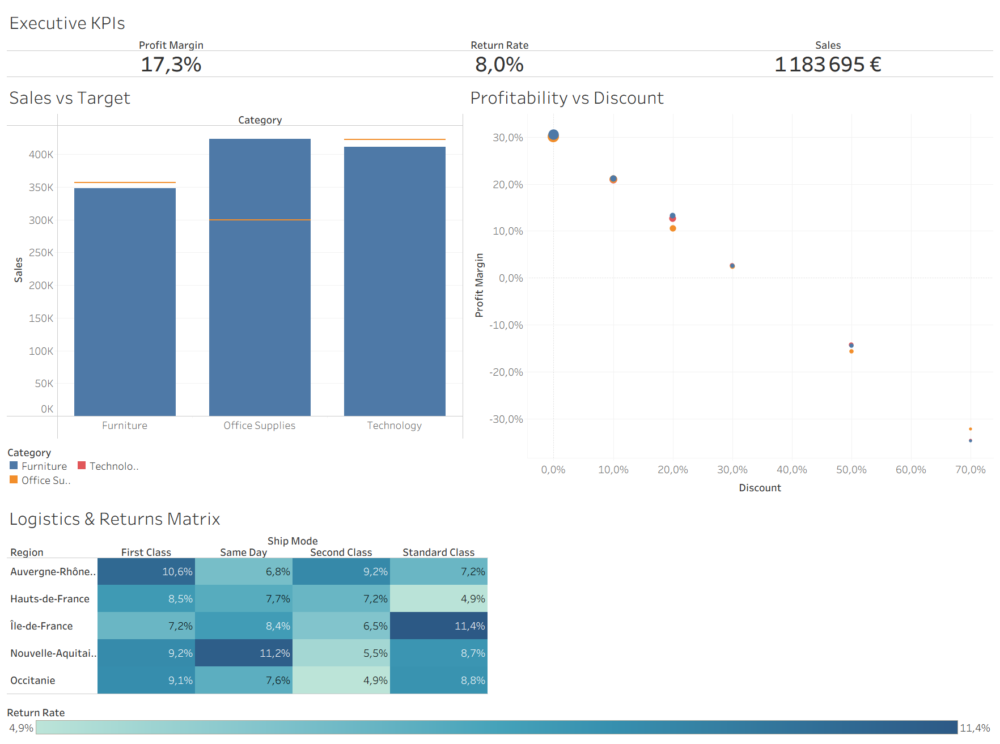
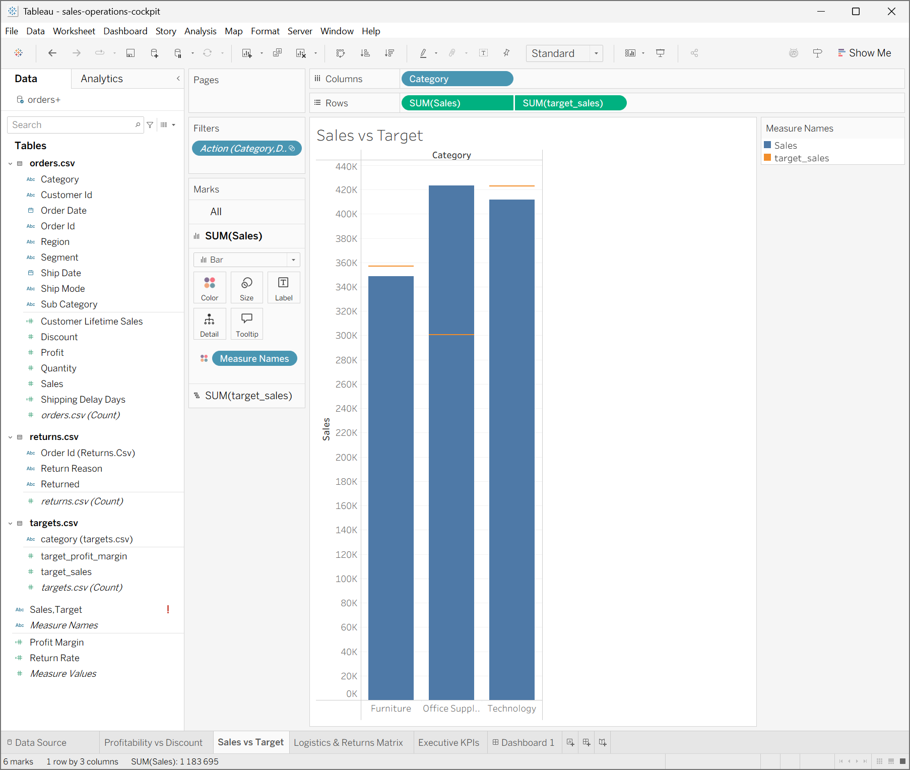
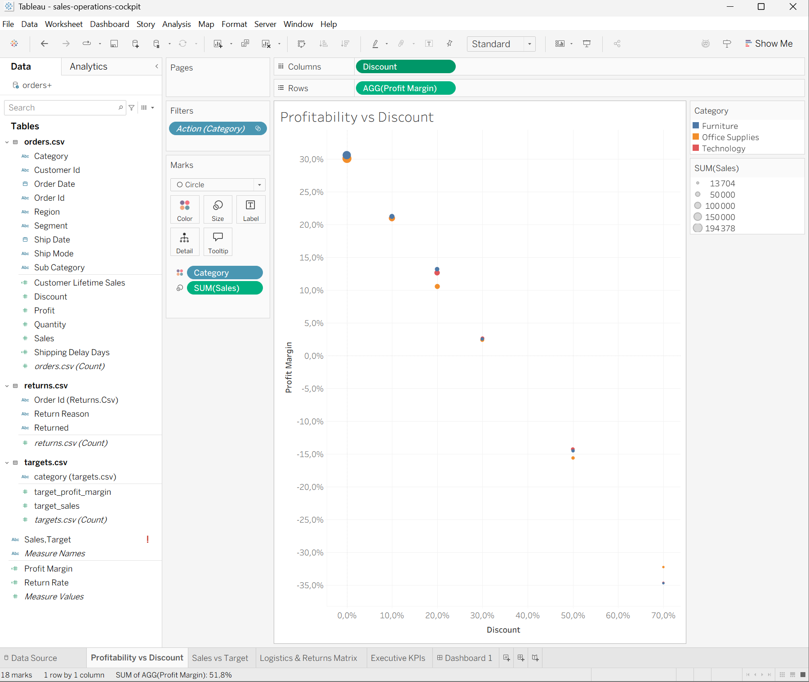
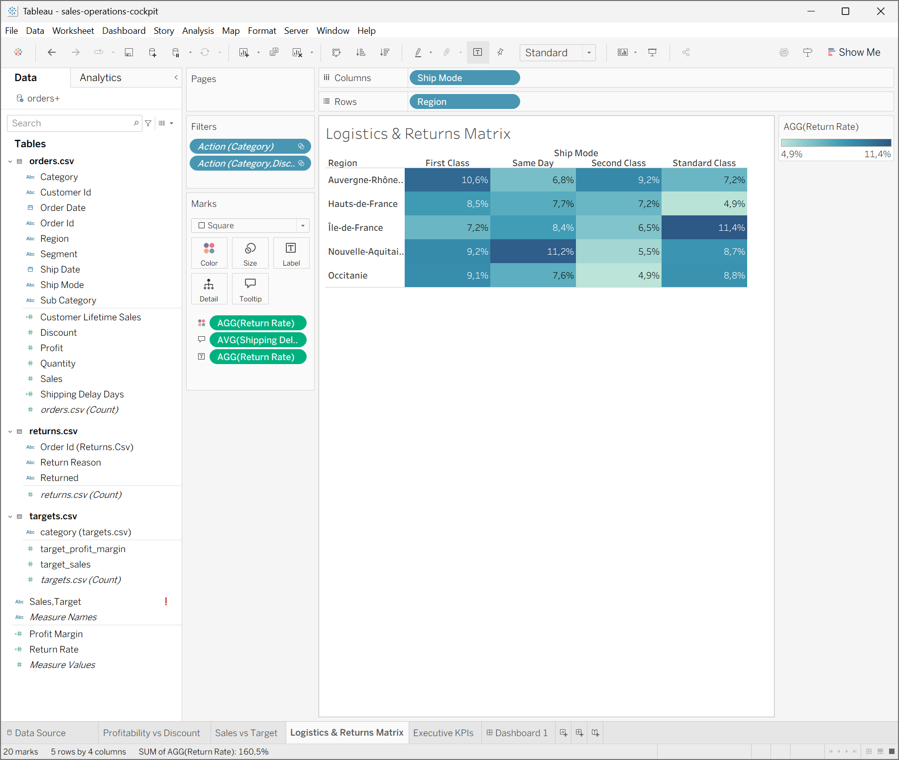

# 📊 Sales & Operations Executive Cockpit (Tableau & Data Modeling)


Tableau de bord exécutif interactif conçu pour aligner la stratégie commerciale, le contrôle de gestion des marges et l'efficience opérationnelle de la supply chain e-commerce.



---

## 📌 Sommaire
1. [Contexte Métier & Problématique](#-contexte-métier--problématique)
2. [Architecture des Données & Schéma Relationnel](#-architecture-des-données--schéma-relationnel)
3. [Calculs Analytiques & Formules Tableau](#-calculs-analytiques--formules-tableau)
4. [Structure du Dashboard & Composants Visuels](#-structure-du-dashboard--composants-visuels)
5. [Insights Métier & Recommandations Actionnables](#-insights-métier--recommandations-actionnables)
6. [Structure du Dépôt](#-structure-du-dépôt)
7. [Installation & Reproduction Locale](#-installation--reproduction-locale)

---

## 🎯 Contexte Métier & Problématique

Dans un environnement retail omnicanal distribué sur 5 régions clés françaises, le comité de direction faisait face à un triple défi opérationnel :
- **Érosion invisible des marges :** Une politique de remises promotionnelles appliquée sans garde-fous clairs réduisant drastiquement le profit net.
- **Suivi hétérogène des objectifs :** L'absence de réconciliation dynamique entre les cibles budgétaires annuelles et les réalisations de ventes par catégorie de produits.
- **Attrition et coûts logistiques :** Des disparités régionales inexpliquées sur les taux de retours colis et les délais d'acheminement selon les transporteurs.

### Objectifs du Dashboard
- Centraliser les 3 indicateurs cardinaux de l'activité (CA total, Taux de Marge Nette, Taux de Retour).
- Révéler le seuil critique d'élasticité prix/remise au-delà duquel les ventes deviennent destructrices de valeur.
- Offrir une navigation interactive par filtres croisés (*cross-filtering*) permettant de diagnostiquer un problème opérationnel en moins de 3 clics.

---

## 🗄️ Architecture des Données & Schéma Relationnel

Le projet repose sur une modélisation multi-tables (schéma relationnel en étoile) connectant trois sources métiers distinctes :

```text
       ┌────────────────────────┐
       │  datasets/targets.csv  │
       │ (Objectifs Budgétaires)│
       └───────────┬────────────┘
                   │
         [category = category]
                   │
                   ▼
       ┌────────────────────────┐                   ┌────────────────────────┐
       │   datasets/orders.csv  │ ◄─[order_id=order_id]─┤  datasets/returns.csv  │
       │    (Table de Faits)    │                   │   (Table des Retours)  │
       └────────────────────────┘                   └────────────────────────┘
```

### Dictionnaire des Données

| Table | Clé / Champ Principal | Type | Description |
| :--- | :--- | :--- | :--- |
| **orders.csv** (5 000 lignes) | order_id (PK) | String | Identifiant unique de commande |
| orders.csv | order_date, ship_date | Date | Jalons temporels de commande et d'expédition |
| orders.csv | ship_mode | String | Mode de livraison (First Class, Same Day, Second Class, Standard Class) |
| orders.csv | customer_id | String | Identifiant unique client |
| orders.csv | region | String | Région commerciale française (Île-de-France, Auvergne-Rhône-Alpes, etc.) |
| orders.csv | category (FK) | String | Catégorie produit (Furniture, Office Supplies, Technology) |
| orders.csv | sales, profit, discount | Numérique | Métriques financières unitaires par commande |
| **returns.csv** | order_id (FK) | String | Référence de la commande ayant fait l'objet d'un retour |
| returns.csv | returned | String | Flag de confirmation (Yes) |
| returns.csv | return_reason | String | Motif déclaré du retour client |
| **targets.csv** | category (PK) | String | Catégorie de référence budgétaire |
| targets.csv | target_sales | Numérique | Objectif de chiffre d'affaires annuel |
| targets.csv | target_profit_margin | Numérique | Objectif contractuel de rentabilité nette |

---

## 🧮 Calculs Analytiques & Formules Tableau

Pour garantir l'intégrité des ratios lors des agrégations et filtrages dynamiques, les mesures ont été construites via des expressions calculées strictes :

### 1. Taux de Marge Nette (Profit Margin)
Évite le biais d'une moyenne de moyennes en sommant les composants avant division :
$$\text{Profit Margin} = \frac{\sum \text{Profit}}{\sum \text{Sales}}$$
```tableau
SUM([Profit]) / SUM([Sales])
```

### 2. Taux de Retour Client (Return Rate)
Dénombre les commandes uniques retournées rapportées au total de commandes distinctes passées :
$$\text{Return Rate} = \frac{\text{Count}(\text{Orders Returned})}{\text{Count Distinct}(\text{Total Orders})}$$
```tableau
COUNT(IF [Returned] = 'Yes' THEN [Order Id] END) / COUNTD([Order Id])
```

### 3. Délai Logistique d'Acheminement (Shipping Delay Days)
Mesure le temps de cycle opérationnel entre la prise de commande et la remise au transporteur :
```tableau
DATEDIFF('day', [Order Date], [Ship Date])
```

### 4. Valeur Vie Client (Customer Lifetime Sales - LOD Expression)
Expression LOD (Level of Detail) au niveau client indépendante du niveau d'agrégation de la vue :
```tableau
{ FIXED [Customer Id] : SUM([Sales]) }
```

---

## 🖥️ Structure du Dashboard & Composants Visuels

Le cockpit est orchestré en 4 zones décisionnelles coordonnées :

### 1. Executive KPI Header (Sommet)
Restitution synthétique des 3 indicateurs cardinaux de l'entreprise :
- **Chiffre d'Affaires Global :** 1 183 695 €
- **Taux de Marge Nette Consolidé :** 17,3 %
- **Taux de Retour Global :** 8,0 %

---

### 2. Performance Commerciale vs Objectifs (Sales vs Target)
Visualisation à double axe synchronisé comparant le chiffre d'affaires réalisé par catégorie aux cibles budgétaires contractuelles (Gantt markers).



---

### 3. Matrice de Rentabilité & Élasticité Promotionnelle (Profitability vs Discount)
Nuage de dispersion mettant en corrélation directe le niveau de remise consenti et le taux de marge nette résiduel, dimensionné par volume de chiffre d'affaires.



---

### 4. Matrice Logistique & Risque Retours (Logistics & Returns Matrix)
Carte thermique (Heatmap) croisant les régions commerciales et les modes d'expédition pour cibler immédiatement les surcoûts et anomalies d'acheminement.



---

## 💡 Insights Métier & Recommandations Actionnables

| Constat / Détection Data | Analyse d'Impact | Recommandation Métier Immédiate |
| :--- | :--- | :--- |
| **Point d'inflexion critique à 20 % de remise** | Dès que la remise commerciale dépasse 20 %, la marge nette s'effondre en territoire négatif (jusqu'à -35 % pour 70 % de rabais). | **Plafonner les remises commerciales :** Verrouiller les délégations tarifaires à 20 % maximum dans l'ERP sans validation formelle de la direction financière. |
| **Décrochage des ventes de Mobilier (Furniture)** | Les ventes réelles de Furniture (~350 k€) restent sous l'objectif budgété (360 k€), alors que Office Supplies surperforme nettement (>420 k€ vs cible de 300 k€). | **Réallouer le budget d'acquisition :** Redéployer une partie des dépenses marketing vers les gammes de produits technologiques et de bureau à plus forte rentabilité. |
| **Vulnérabilité logistique en Île-de-France (Standard Class)** | Le taux de retour atteint 11,4 % en Île-de-France sur le mode Standard, contre une moyenne nationale de 8,0 %. | **Auditer les transporteurs franciliens :** Conduire une revue contractuelle des prestataires du dernier kilomètre et vérifier l'intégrité des colis livrés sur ce corridor. |

---

## 📁 Structure du Dépôt

```bash
sales-operations-cockpit/
├── datasets/
│   ├── orders.csv                  # Table de faits des transactions commerciales
│   ├── returns.csv                 # Table des événements de retours marchandises
│   └── targets.csv                 # Table des objectifs budgétaires annuels par catégorie
├── images/
│   ├── sales_vs_target.png         # Capture de la vue commerciale vs objectifs
│   ├── profitability_discount.png  # Capture de la vue marge vs remises
│   └── logistics_matrix.png        # Capture de la matrice thermique logistique
├── generate_pipeline.py            # Script Python de génération et modélisation des flux
├── sales-operations-cockpit.twbx   # Classeur packagé Tableau Desktop complet
├── cockpit_preview.png             # Vue globale du cockpit exécutif
└── README.md                       # Documentation technique et stratégique du projet
```

---

## ⚙️ Installation & Reproduction Locale

### Prérequis
- Tableau Desktop (version 2026.2.2)
- Python 3.9+ 

### Exécution
1. **Cloner le projet en local :**
   ```bash
   git clone [https://github.com/](https://github.com/)<ton-username>/sales-operations-cockpit.git
   cd sales-operations-cockpit
   ```
2. *(Optionnel)* **Régénérer les données sources :**
   ```bash
   python generate_pipeline.py
   ```
3. **Ouvrir le classeur Tableau :**
   Double-cliquer sur `sales-operations-cockpit.twbx` pour explorer le dashboard, ses calculs et son interactivité native.